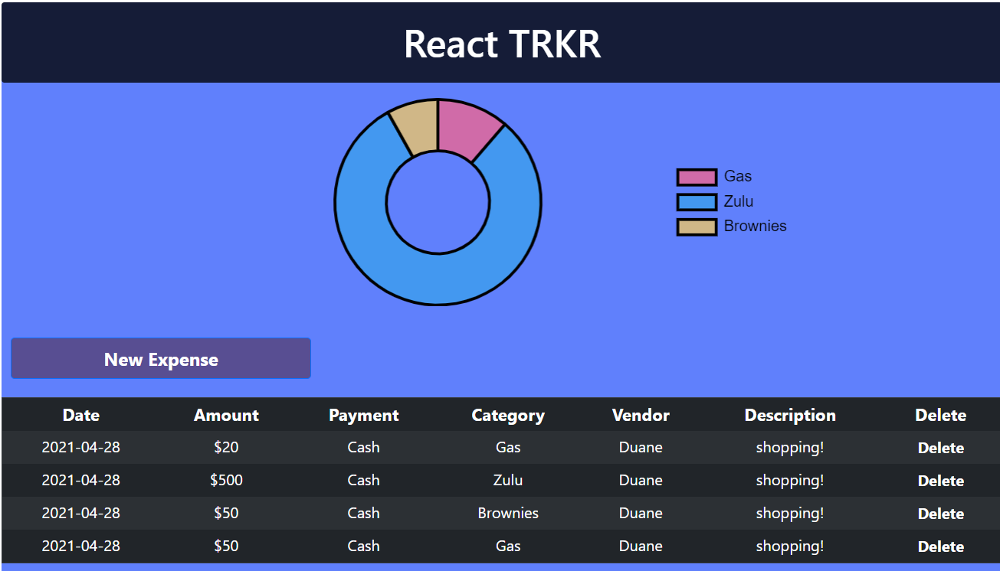

# React Expense Tracker

A financial traking app build with React js, Bootstrap 5, Adobe XD and Heroku.

try <a href="https://expense-tracker-react-dm.herokuapp.com/"> React TRKR on Heroku  </a>!

## Summary

This app was an ejoyable build. I used this platform to inform my React knowledge. In the process I added several npm packages including Bootstrap 5, Chart.js, and poppper. This app pushed me into learning the react context api. I chose context over redux to keep the code as lean as possible.

#### Wish List

<ul>
  <li> LocalStorage
  <li> Summary Table
  <li> Update on direct edit
</ul>

## Technologies

<ul>
  <li> React, Bootstrap, Git
  <li> HTML5, CSS, JavaScript
  <li> HTML Canvas
  <li> LocalStorage
</ul>

### Author

Duane McDonald | Software Developer  
<a href="https://www.linkedin.com/in/duane-mcdonald-48a90136">linkedIn</a>  
<a href="https://www.DuaneMcDonald.com">Personal Website</a>  

